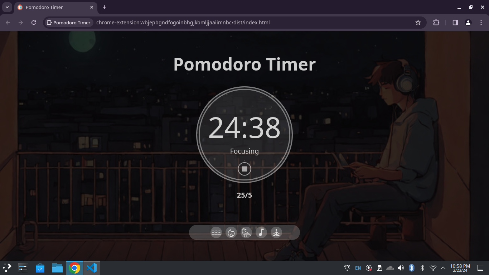
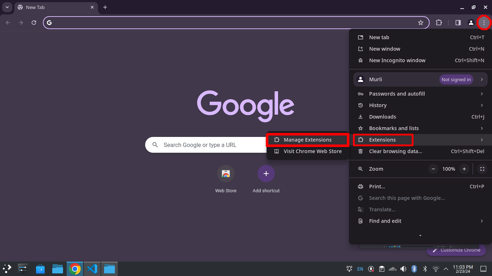
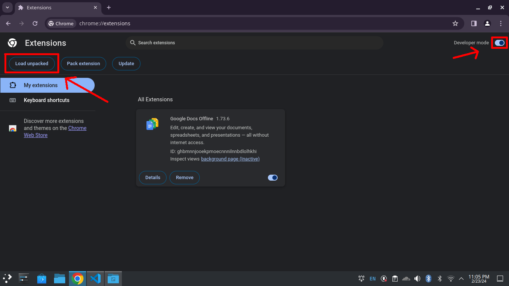

# Promodoro Timer

>This is a simple pomodoro timer. Pomodoro timer is used for concentration. The general rule is to focus for 25 minutes then rest for 5 minutes.

## How to use it?

You can use this pomodoro timer by the following options:
1. [As a simple webpage](#use-as-a-webpage)
2. [As a chrome extension](#use-as-a-chrome-extension)

### Use as a webpage
You can use it as a simple website.
- **Step-1:** Clone the repository then go to the dist folder.

- **Step-2:** Right click on the `index.html` and open with your suitable browser. You are good to go.

- **Step-3:** You can bookmark it so that you can use it later.

### Use as a chrome extension
You can also use it as a chrome extension. Currently this is not available in chrome web store. So you have to clone this repository and then use it.

- **Step-1:** Clone the repository then go to the dist folder.
- **Step-2:** Open chrome then navigate to 
    - Tripple dot menu `⋮` > `Extensions` > `Manage Extensions`

    
- **Step-3:** On the top right corner there is option for `Developer Mode`, turn it on.

    

- **Step-4:** After turning on the developer mode there will be additional option on the top left corner. Click on the `Load unpacked` option. Then select the folder of the git repository. Then you are good to go. Whenever you click on the extension a new page will be open where you can use the pomodoro timer.

